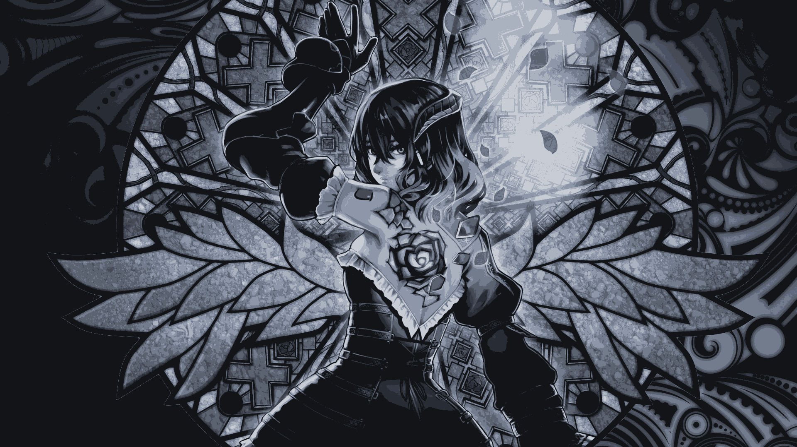

# BTINT (Terminal Image Normalizer & Tinter)

**BTINT** (Terminal Image Normalizer & Tinter) replaces the colors of an image with the closest matches from a palette you choose. This lets you easily adapt any image to fit your desired color scheme. It’s built with **Bun runtime** and is very easy to use.

BTINT comes with several built-in palettes, but you can also provide your own.
See #Usage below for more information.

> [!NOTE]
> **BTINT** is still in pre-release.
> If you find any bugs, please report them by opening an issue.

---

## Demo Gallery

| Original                    | Catppuccin Latte                      | Catppuccin Mocha                      | Dracula                        |
| --------------------------- | ------------------------------------- | ------------------------------------- | ------------------------------ |
|  |  |  |  |

| Everforest                           | Gruvbox                        | Kanagawa                         | Rose Pine                         |
| ------------------------------------ | ------------------------------ | -------------------------------- | --------------------------------- |
|  |  |  |  |

| Nord                           | One Dark                        | Solarized                         | Tokyo Night                         |
| ------------------------------------ | ------------------------------ | -------------------------------- | --------------------------------- |
|  |  |  |  |

---

## Installation

To install BTINT, npm must be installed on your system.

```
bun i -g @sanalzio/btint
```

---

## Usage

```bash
Usage: btint [options] [images...]

Arguments:
  images                   input images

Options:
  -o, --output <path>      output folder
  -t, --theme <name>       theme name
  -p, --palette <palette>  custom palette (path to JSON file or flat RGB
                           list)
  -h, --help               display help for command
```

```bash
# Apply a theme to an image
btint -o output -t "Catppuccin Mocha" input.png input2.jpg

# Use a custom palette (from a file)
btint -o outdir -p ./my-palette.json input.png

# Use a custom palette (inline RGB list)
# ! Not supporting other color formats
btint -o dist -p "[[255,0,0], [0,255,0], [0,0,255]]" pic.webp
```

### Themes

Available themes:

```
 - Catppuccin Frappe
 - Catppuccin Latte
 - Catppuccin Macchiato
 - Catppuccin Mocha
 - Dracula
 - Everforest
 - Gruvbox
 - Kanagawa
 - Nord
 - Rose Pine
 - Rose Pine Dawn
 - Rose Pine Moon
 - Solarized
 - Tokyo Night
 - One Dark
```

#### Custom theme syntax
Add colors following [this styles](https://bun.sh/docs/runtime/color#flexible-input)

```json
{
    "theme_name": [

        "rgb(255, 0, 0)",
        "hsl(0, 100%, 50%)",
        [255, 0, 0],
        { r: 255, g: 0, b: 0 }

    ]
}
```

---

## Issues

If you encounter a bug or have a suggestion, please report it via [Issues](https://github.com/sanalzio/BTINT/issues).

---

## License

This project is licensed under the GPL-3.0 License. For more details, please refer to the [LICENSE](LICENSE) file.

---
